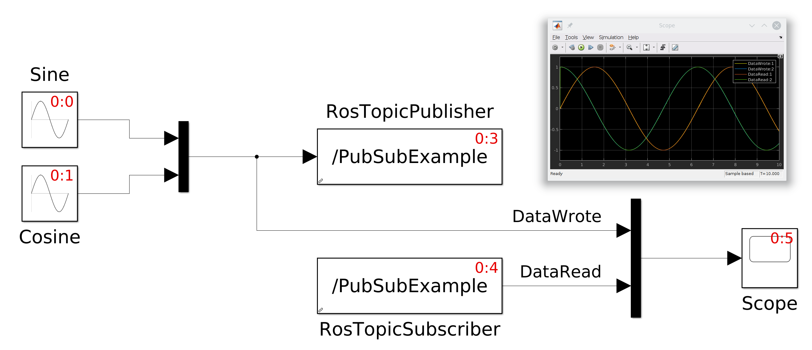

# blockfactory-demo-ros

[](https://travis-ci.com/diegoferigo/blockfactory-demo-ros)
[](https://github.com/robotology/blockfactory-demo-ros/blob/master/LICENSE)

This repository contains a [`robotology/blockfactory`](https://github.com/robotology/blockfactory) plugin that provides a proof-of-concept implementation of ROS functionalities.

The plugin provides two classes:

- `RosTopicPublisher` Publishes a vector message to a topic
- `RosTopicSubscriber` Subscribes to a topic and reads the streamed message

The classes provided in this plugin have been implemented following these tutorials and documentation:

- [Writing a Simple Publisher and Subscriber (C++)](http://wiki.ros.org/ROS/Tutorials/WritingPublisherSubscriber%28c%2B%2B%29)
- [Publishers and Subscribers](http://wiki.ros.org/roscpp/Overview/Publishers%20and%20Subscribers)
- [Callbacks and Spinning](http://wiki.ros.org/roscpp/Overview/Callbacks%20and%20Spinning)

## Setup

After installing  [`robotology/blockfactory`](https://github.com/robotology/blockfactory) , execute the following commands to build the example:

```bash
mkdir build
cd build
cmake ..
cmake --build .
```

## Simulink

In order to support Simulink, we provided a small `RosToolbox.slx` Simulink Library with two blocks wrapping the two classes stored in the plugin library. From a Linux distribution, execute:

```bash
# From the root of the repository:
export LD_LIBRARY_PATH=$(pwd)/build:$LD_LIBRARY_PATH
export MATLABPATH=$(pwd)/matlab:$MATLABPATH
matlab
```

Now you can open the `RosPubSubExample.mdl` model and press the _Play_ button:



## Autogenerated code

### Use provided autogenerated code

We provide an example of the sources autogenerated from the `RosPubSubExample.mdl` model in the [matlab/RosPubSubExample_grt_rtw](matlab/RosPubSubExample_grt_rtw) folder.

In the [Setup](#setup) section, the target associated with the autogenerated sources has been already compiled. You can run it as follows:

```
cd build
roscore &
./main
```

The [main.cpp](src/main.cpp) will run for 10 seconds. You can check that it is publishing to a topic from another terminal:

```bash
rosnode list
# You should see /RosToolbox
rostopic list
# You should see /PubSubExample
rostopic echo /PubSubExample
# You should see:
# layout: 
#   dim: 
#     - 
#       label: "/PubSubExample"
#       size: 2
#       stride: 1
#   data_offset: 0
# data: [-0.9991017216871848, -0.042376287257181525]
```

### Generate the code

If you have Simulink Coder you can generate code from the model by pressing the _Build_ button from the Simulink GUI. Note that in order to use the provided CMake project, your active directory in the Matlab workspace should be `matlab/`.

Then:

```bash
# Compile it
cd build
cmake --build .
# Run it
./main
```
